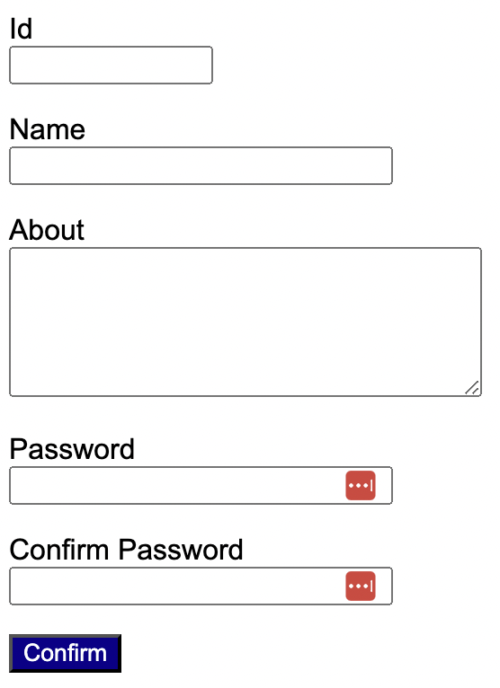
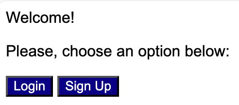
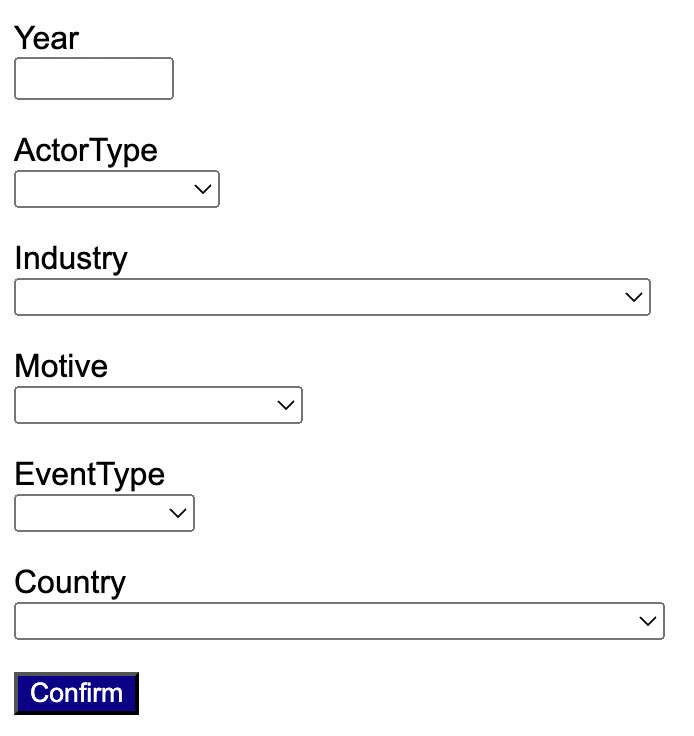
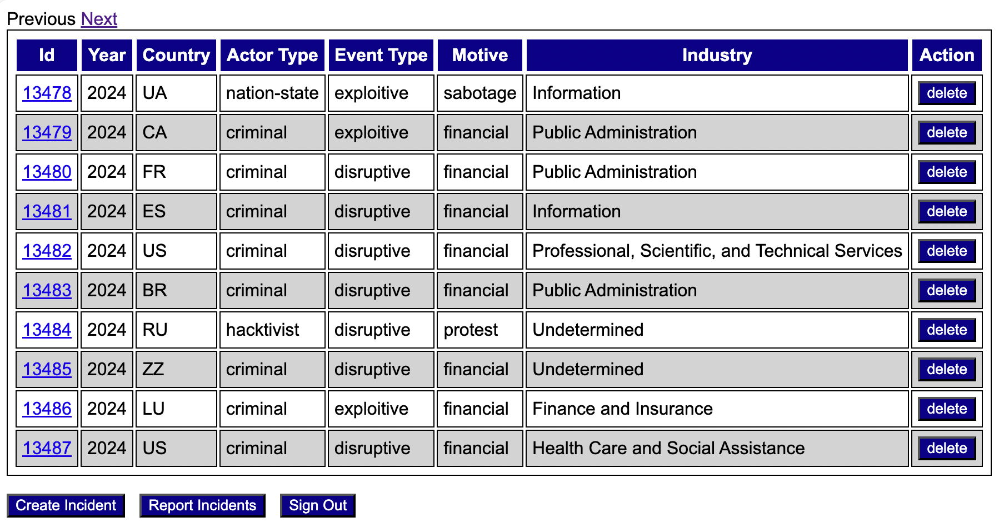
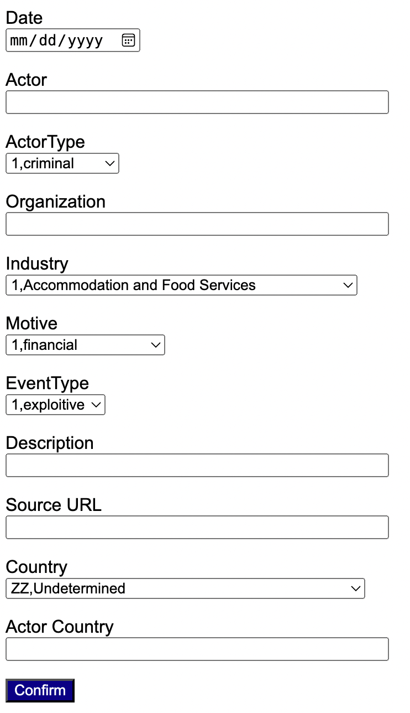
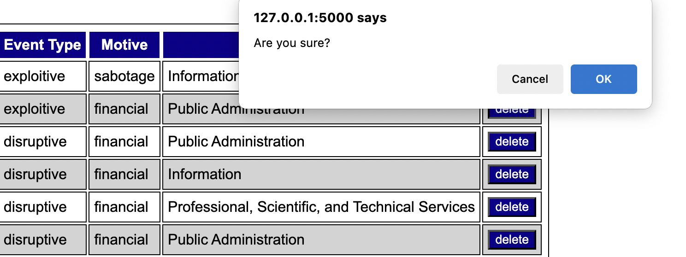
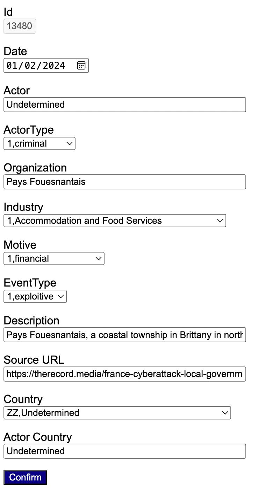
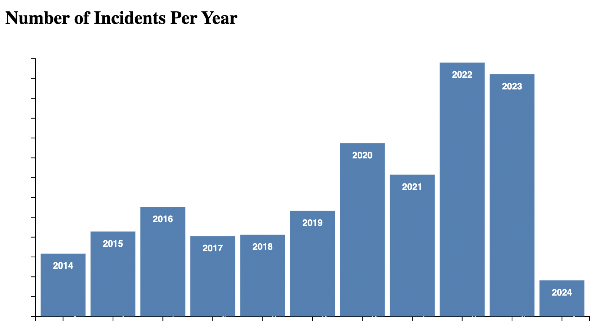
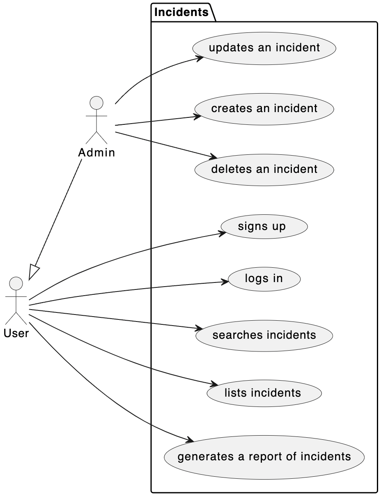
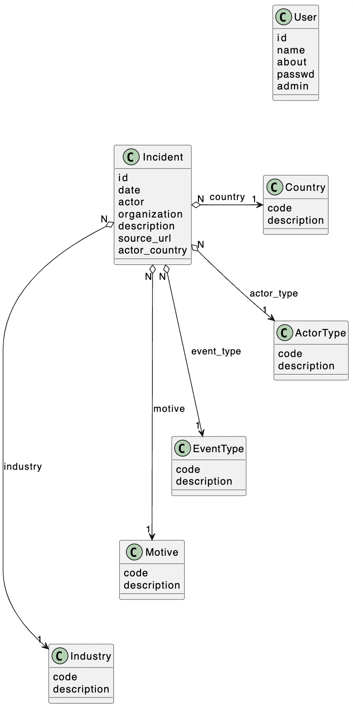

[](https://classroom.github.com/a/UQ0ssmAb)
# The Vision 

Cyber threats are on the rise, fueled by financial gain, espionage, and sabotage. The first step to combating these threats is raising awareness. Imagine a powerful web app called **Incidents** that not only educates but also empowers users by creating a comprehensive database to monitor and analyze cyber attacks globally. This innovative tool will be a game-changer in the fight against cybercrime, providing real-time insights and fostering a safer digital world.

# User Stories 

This section describes key **user stories** identified for **Incidents**. Screenshots are provided to ilustrate each of the user stories. Feel free to come up with a different design. 

## US#1: User Registration (sign up)

As a user, I want to register on the platform to search the database of cyber incidents. When I provide all the required information (user ID, name, a short description, and password) and click 'submit', my account should be created. Additionally, some users will be configured as administrators offline.

```
TODO: estimate of effort in terms of user story points: 1
```



## US#2: User Authentication (log in)

As a registered user, I want to log in to the platform. When I enter my user ID and password, the system should verify my credentials. If they match the records in the database, I should be granted access to navigate the app.

```
TODO: estimate of effort in terms of user story points: 1
```



## US#3: Search Incidents

As a registered user, I want to search for cyber incidents by year, actor type, industry, motive, event type, and country. When I enter my search parameters and click 'confirm,' I should be redirected to a section of the application (see US#4) that displays the cyber threats filtered by my criteria.



```
TODO: estimate of effort in terms of user story points: 2
```

## US#4: List Incidents

As a registered user, I want to view a summarized table of cyber incidents based on specific search criteria. The table should display a limited number of incidents (e.g., 10) to fit the screen. I should be able to navigate forward and backward through the filtered list of incidents.

```
TODO: estimate of effort in terms of user story points: 3
```



## US#5: Create an Incident

As an administrator, I want to create new cyber incidents. Each incident should have a unique ID and include, at a minimum, the following information: date of the incident, perpetrating actor, actor type, target organization, industry, motive, event type, a short description, a source URL with more details, the affected country, and the actor’s country. More information about those data fields can be obtained from [Cyber Events Database Home](https://cissm.umd.edu/research-impact/publications/cyber-events-database-home).

```
TODO: estimate of effort in terms of user story points: 2
```



## US#6: Delete an Incident

As an administrator, I want to delete cyber incidents. When I provide the incident’s ID and confirm, the incident should be removed from the database.

```
TODO: estimate of effort in terms of user story points: 2
```



## US#7: Update an Incident

As an administrator, I want to update cyber incidents. When I provide the incident’s ID, the incident’s information should be retrieved from the database and displayed, allowing me to edit the fields. Upon confirmation, the updated information should be saved. 

```
TODO: estimate of effort in terms of user story points: 2
```



## US#8: Generate a Report of Incidents

As a registered user, I want to generate a bar plot that summarizes the number of cyber incidents per year so that I can easily visualize trends and patterns over time

```
TODO: estimate of effort in terms of user story points: 3
```



# Design 

An initial design for the project can be found in the [UML](/uml) folder. The design is given as a suggestion. Feel free to come up with your own design.  

## Use Case Diagram


## Class Diagram 


# Implementation 

You are expected to implement user stories 1-7. User story #8 is optional (bonus points will be given). You are required to use Python in your implementation, with Flask with SQL Alchemy. 

Considering the short amount of time to implement the project, the following is given to you (although not required to use):

* incidents.sql (database model)
* init_db.py (creates and populates the database)
* models.py (SQLAlchemy model that matches the database; consistent with the UML class diagram)

Suggested routes are also given in **routes.py**. 

You are required to incorporate caching into your project. **Flask-Caching** is a module that adds caching support to Flask. The following lines were added to **__init__.py**, which sets the caching timeout to 5 minutes. 

```
# cache setup
from flask_caching import Cache
cache = Cache()
cache.init_app(app, config={
    'CACHE_TYPE': 'simple',
    'CACHE_DEFAULT_TIMEOUT': 300
})
```

The example below illustrates how to use caching to query for countries. 

```
from app import cache

countries = cache.get("countries")
if not countries: 
    # cache miss!
    countries = db.session.query(Country).all() 
    cache.set("countries", countries)
```

You **must** use the following structure to organize your project. 

```
scrum
|__sprint# (one folder for each sprint, so sprint1, sprint2, and sprint3)
|____planning.md
|____daily.md
|____review.md
|____retrospective.md
src
|__app
|______init__.py
|____models.py
|____routes.py
|____forms.py
|__instance
|____incidents.db
|__static
|____style.css
|__templates
|____base.html
|____index.html
|____ ...
|__init_db.py
tests
|__create_incident_test.py
uml
|__class.wsd
|__use_case.wsd
README.md (updated with the user story points)
requirements.txt
Dockerfile
```

# Testing 

You are required to implement at least one *black box* testing using Selenium that verifies the creation of a new incident (US#5). 

# Deployment 

Commit and push your project using "final submission" as the commit message. You should also create a Docker image that would allow the instructor to run your project as a container. For that requirement, you should create a Dockerfile that allows the instructor to create the image of your project and from that image to run your project as a container. 

# Scrum 

Your team will be evaluated on how closely you managed this project according to the Scrum framework and how effectively you worked as a member of a Scrum team. Each unit of work (user story) must have a clear effort estimate in points. Each sprint must have a clear goal statement. The team must record notes from their daily Scrum meetings. Additionally, there should be notes for the sprint review and retrospective meetings at the end of each sprint. Refer to the Scrum folder for a sprint documentation template.

The project progress should be recorded at the end of each sprint using a burndown diagram. Use the provided template in "/scrum/burndown_template.xlsx" to record your progress and generate the burndown diagram. 

# Rubric 

```
+7 for each required user story successfully implemented, up to (rounded-up) 40 points
+5 using cache 
+10 for the required black-box testing
+5 project's deployment
+8 for each of the overall scrum notes for each sprint, up to (rounded-up) 25 points
+15 team/self evaluation
+5 bonus points for US#8
```
